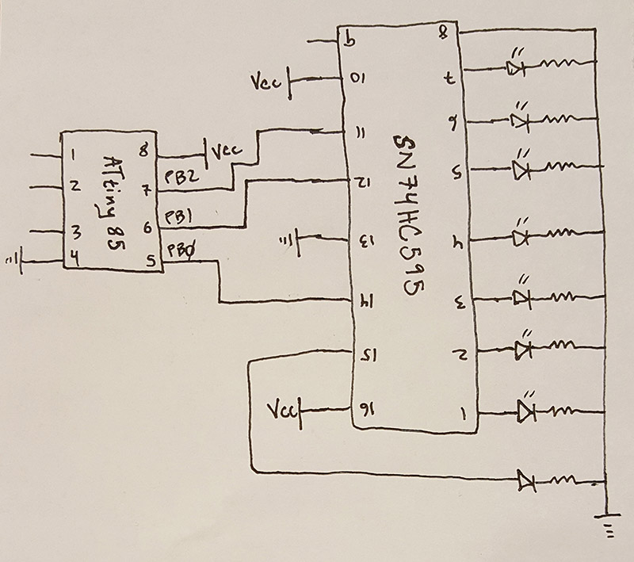

# AVR Shift Register

> A super simple example of using an 8-bit shift register with an ATTiny85.

## Introduction

This program simply pushes 8-bits to a serial-in/parallel-out shift register. The output
pins of the shift register are connected to LEDs.  The program then makes a little dance
with the LEDs, but mostly I made this just to learn how to use a shift register.

## Ingredients

* ATTiny85
* SN74HC595 8-bit Shift Register
* Some LEDs &amp; Resistors

## Install

_NOTE: The makefile uses `avr-gcc` and `avrdude` to compile and upload. It also assumes you're using `usbtiny` programmer, like the Sparkfun Pocket AVR Programmer._

1.  Connect your programmer

1.  Compile and upload

    ```
    $ make upload
    ```

## Schematic



## Wiring Notes

* PIN 10 (SRCLR') on the shift register needs to go to VCC.
* PIN 13 (OE') on the shift register needs to go to GND.

## Resources

* [Datasheet for SN74HC595 shift register](http://www.ti.com/lit/ds/symlink/sn74hc595.pdf)
* [Sparkfun's page for the shift register ](https://www.sparkfun.com/products/13699)
* [Super useful description of how a shift register works, with graphs!](http://www.allaboutcircuits.com/textbook/digital/chpt-12/serial-in-parallel-out-shift-register/)
* [Instructable with a really good makefile and code](http://www.instructables.com/id/Honey-I-Shrunk-the-Arduino-Moving-from-Arduino-t/?ALLSTEPS)
* [General info on ATTiny85 registers and ports](https://teslaui.wordpress.com/2013/03/26/attiny85-port-registers/)
* [Notes on connecting and programming the ATTiny85](https://github.com/cullylarson/avr-programming)
